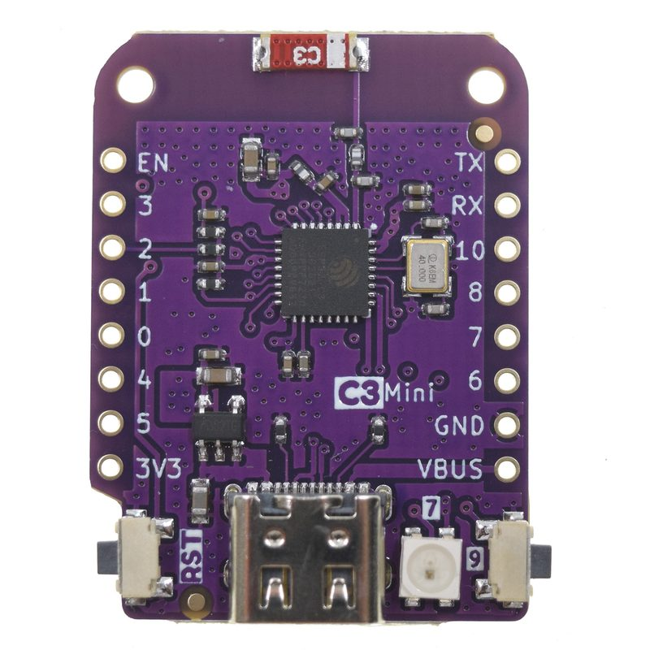

# ESP32-C3-Mini (Lolin C3 Mini Mainboard)

[中文文档](README.zh.md) | [English](README.md)

[](https://github.com/Mi-Bee-Studio/esp32-c3-mini/actions/workflows/build.yml)



A board under the board-centric repo convention. **This repo is organized with the board as root:**

```
esp32-c3-mini/
├── README.md          # this file: all hardware info for this board
└── <project>/         # one directory per project built on this board (named by capability)
    ├── CMakeLists.txt / main/ / sdkconfig.defaults / main/idf_component.yml
    └── README.md      # project description + build/flash commands
```

Key points of the convention:

- **Board directory name** = board name (kebab-case); the root README covers hardware only, never project content;
- **Each project directory builds standalone**: it ships the full ESP-IDF project trio (top-level CMakeLists,
  `main/`, `sdkconfig.defaults`); `cd <project> && idf.py build` produces the firmware;
- Projects share no code; when commonality is needed, copy first, and consider extracting a shared component only once things stabilize.

### Firmware baseline norms (mandatory fleet-wide)

1. **Watchdog: mandatory.** Tasks subscribe to the ESP-IDF TWDT and feed it periodically;
2. **Web/API firmware upgrade (OTA): mandatory where the hardware allows.** WiFi plus
   4 MB flash fit dual OTA slots, so every project ships a web upgrade path.

| Project | Watchdog | Web/API OTA |
|---------|----------|-------------|
| blink | ✅ per-task TWDT (5 s panic) | ✅ dual OTA slots + streaming `POST /ota` |

---

## Board Overview

| Item | Value |
|------|-------|
| Module/chip | **ESP32-C3FH4** — RISC-V single-core @ 160 MHz (4 MB flash in-package, no PSRAM) |
| Flash | 4 MB (embedded) |
| PSRAM | None |
| Wireless | 2.4 GHz WiFi b/g/n + Bluetooth 5 (LE) |
| USB | Native USB Type-C (**USB-Serial-JTAG**: console + flashing, no bridge chip) |
| Onboard LED | **WS2812B RGB = GPIO7** (addressable; Arduino official board def `PIN_RGB_LED=7`) |
| Buttons | BOOT = GPIO9 (standard C3 strapping, hold at power-up for download), RESET |
| Breakout | 12× digital IO (D1 mini shield-compatible form factor) |
| Dimensions | 34.3 × 25.4 mm (D1 mini form factor, accepts Lolin/D1 mini shields) |
| Factory | Ships with MicroPython by default; this repo uses **ESP-IDF** (v6.0) |
| Source | Board facts from the [Wemos/Lolin official page](https://www.wemos.cc/en/latest/c3/c3_mini.html) + the [Arduino official board definition](https://github.com/espressif/arduino-esp32/tree/master/variants/lolin_c3_mini) — the most common board named "esp32-c3-mini"; **if your carrier board is a different vendor, trust the actual board** |

## Pinout Diagram (USB-C pointing up, front/component-side view; functional pin map)

```
                 ┌─ USB-C ─┐
                 │ [WS2812]│
                 │  =GPIO7 │   ESP32-C3FH4
                 │ [RST]   │   4MB flash (in-package, no PSRAM)
                 │ [BOOT]  │   12× IO (D1 mini form factor)
                 └─────────┘
  The physical pad order is not documented as a table on the official
  page — follow the official wemos.cc pinout diagram for wiring; do not
  infer wiring from this figure.
```

Key points (pin functions per the Arduino official board definition `lolin_c3_mini/pins_arduino.h`):

- **WS2812 RGB = GPIO7**; **BOOT = GPIO9**; UART0 TX=GPIO21 · RX=GPIO20;
- I2C: SDA=GPIO8 · SCL=GPIO10; SPI: SS=GPIO5 · MOSI=GPIO4 · MISO=GPIO3 · SCK=GPIO2;
- ADC: A0–A5 = GPIO0–5;
- **GPIO18/19 = USB D-/D+** (generic C3 constraint) — do not repurpose; GPIO2/8/9 are
  strapping pins — mind their power-on levels when attaching peripherals.

## Caveats

- **No USB-UART bridge**: the serial port is the C3's native USB-Serial-JTAG (console/flashing/JTAG on one port);
- Download mode: hold BOOT (GPIO9) while plugging USB / pressing RESET;
- No PSRAM — plan large buffers around the ~400 KB SRAM class (same league as luatos-esp32c3);
- The board ships with MicroPython — flashing ESP-IDF firmware replaces it (re-flashable);
- D1 mini shield compatibility is this board's differentiator (3.3 V logic — mind compatibility with older 5 V shields).

## Project Index

| Project | Description |
|---------|-------------|
| [blink](blink/README.md) | Baseline/test firmware: WS2812 (GPIO7) status-color rotation + BOOT interaction + web maintenance page (provisioning/OTA) + TWDT watchdog |
